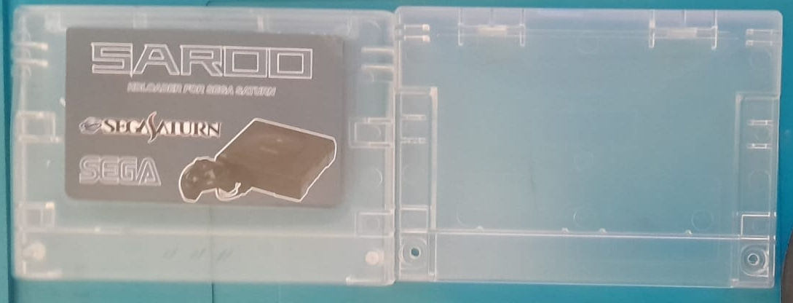
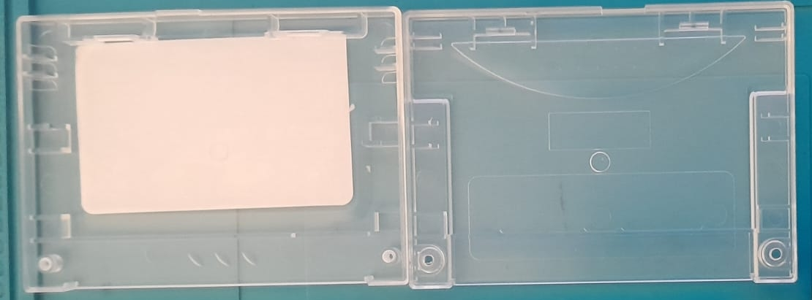
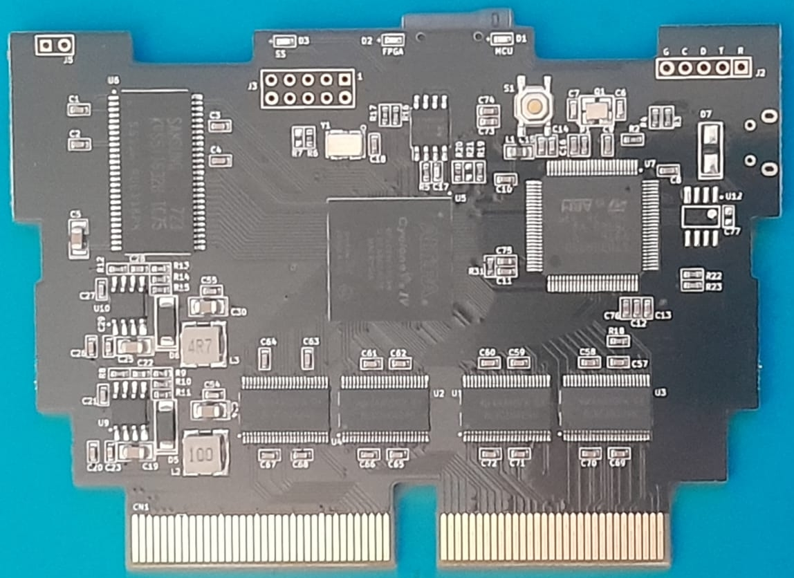
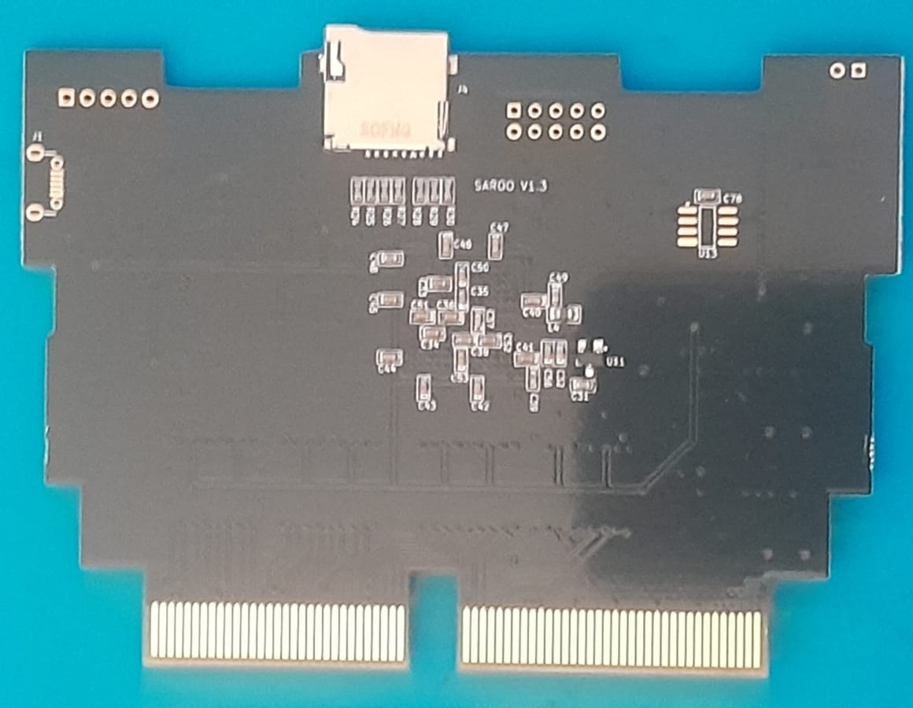
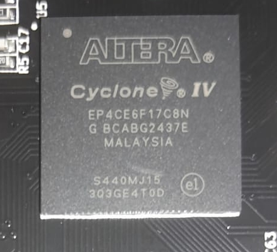
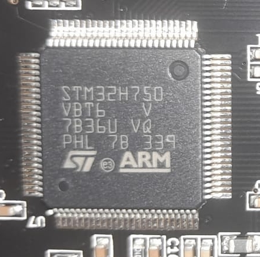
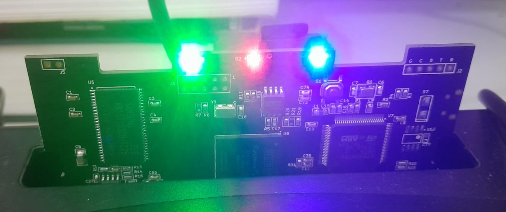

[English](README.md) | **Português**

# SAROO - Model do Cartucho

### Informações Gerais

- <b>Fornecedor/Loja:</b> [Epicjoy Game Store](https://s.click.aliexpress.com/e/_c3VfULT5)
- <b>Versão:</b> V1.3
- <b>Modelo:</b> Cartucho Preto

#### Links de Compra (AliExpress)

- https://s.click.aliexpress.com/e/_c4TDWWhz

#### Alguns Chips

- 4AAYDFK G4 / ALVC164245 (4 chips)
- ALTERA Cyclone IV / EP4CE6F17CBN / G BCABG2437E / MALAYSIA / S440MJ15 / 303GE4T0D (1 chip)
- SAMSUNG 723 / K4S511632B-TC75 / S5116 AUE118PX (1 chip)
- STM32H750 / VBT6 V / 7836U VQ / PHL 7B 339 / ST ARM (1 chip)

#### Imagens

Carcaça Externa:

Carcaça Interna:

Frente da Placa:

Costas da Placa:

4AAYDFK G4 / ALVC164245 (4 chips)

ALTERA Cyclone IV / EP4CE6F17CBN / G BCABG2437E / MALAYSIA / S440MJ15 / 303GE4T0D (1 chip)

SAMSUNG 723 / K4S511632B-TC75 / S5116 AUE118PX (1 chip)

STM32H750 / VBT6 V / 7836U VQ / PHL 7B 339 / ST ARM (1 chip)

Luzes:

