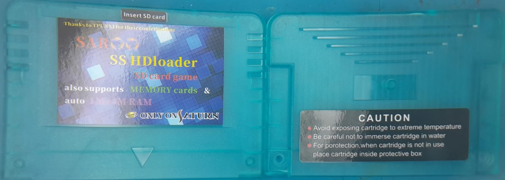
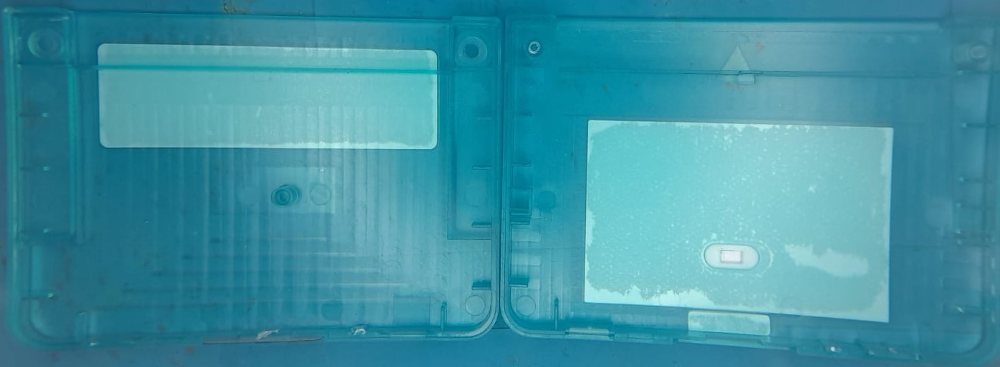
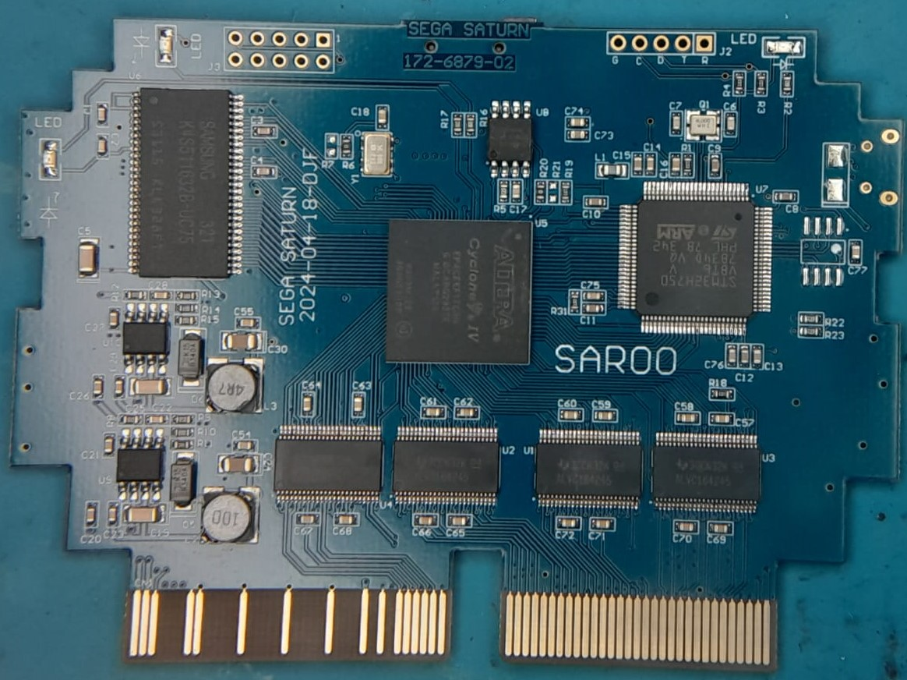
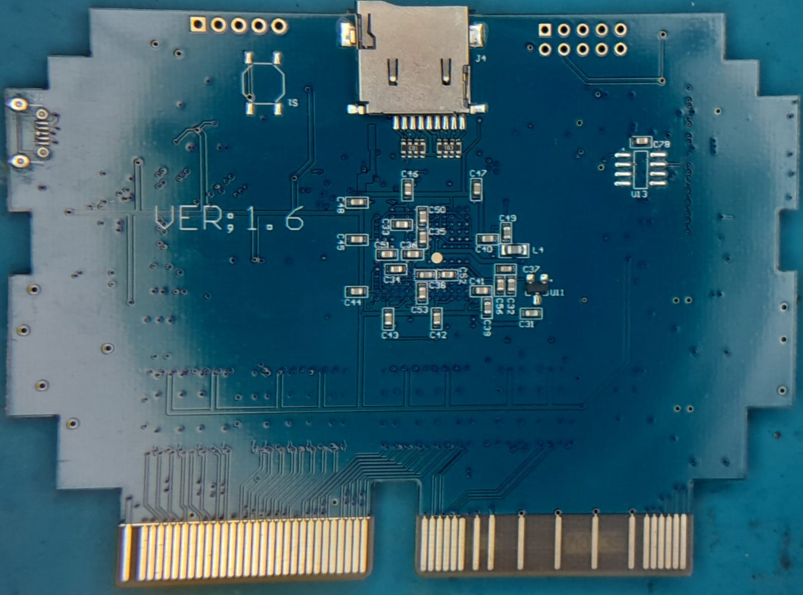
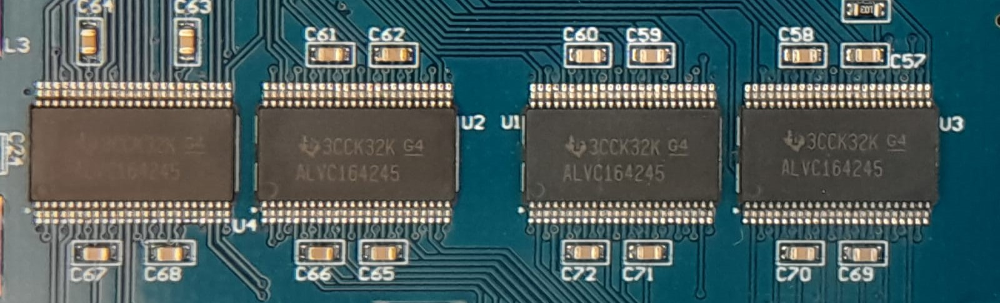
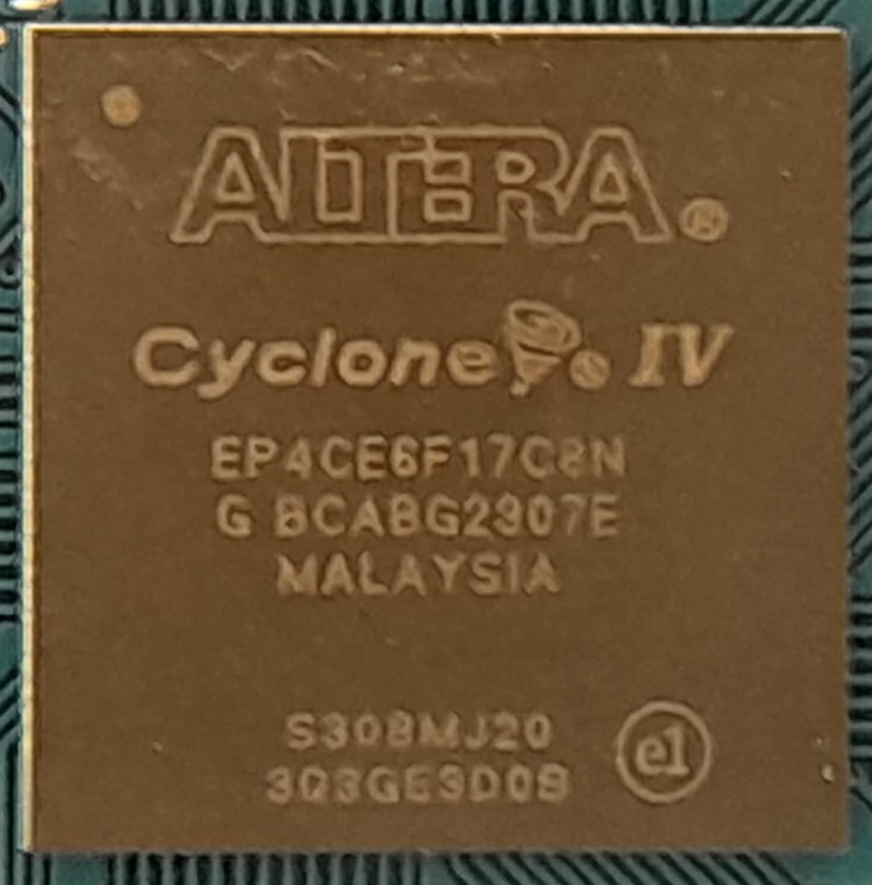
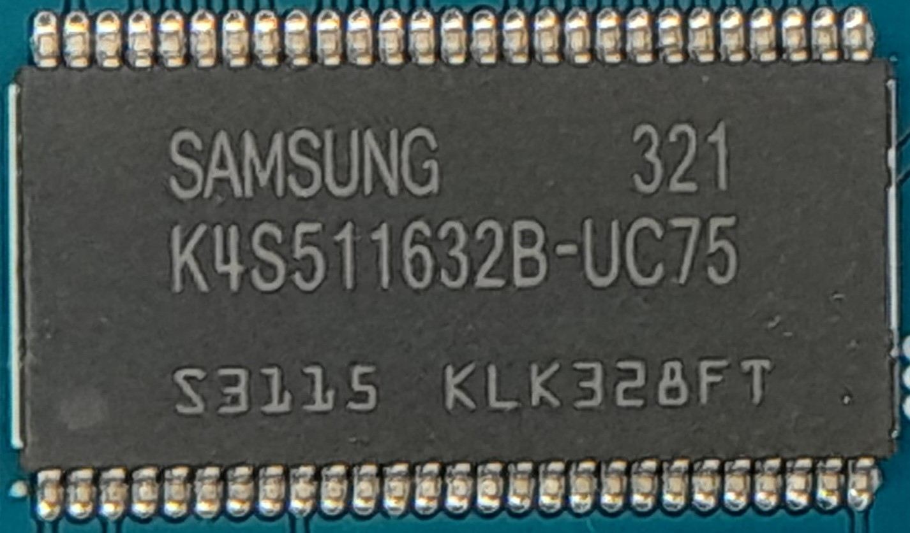
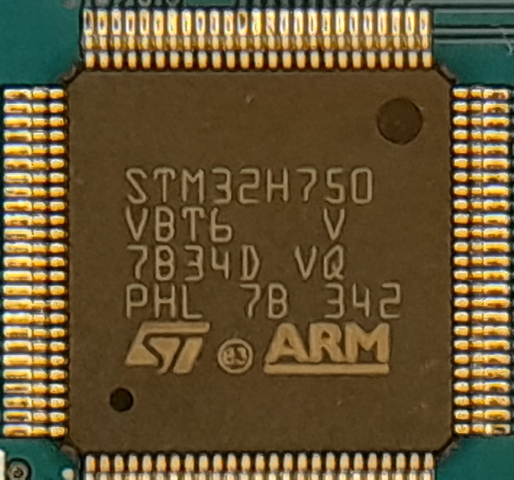
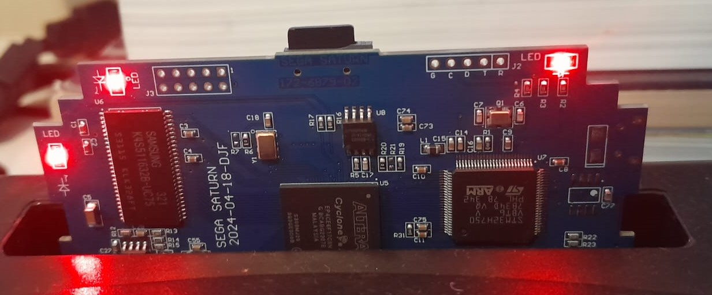

**English** | [Português](pt-br.md)

# SAROO - Cartridge Model

### General Info

- <b>Vendor:</b> [Guangzhou San Star Online Shop](https://s.click.aliexpress.com/e/_Dmwjf6r)
- <b>Version:</b> V1.6
- <b>Model:</b> Blue Card (Elite)

#### Purchase Links (AliExpress)

- https://s.click.aliexpress.com/e/_DB1riYr
- https://s.click.aliexpress.com/e/_Dmwjf6r

#### Some Chips

- 3CCK32K G4 / ALVC164245 (4 chips)
- ALTERA Cyclone IV / EP4CE6F17CBN / G BCABG2307E / MALAYSIA / S308MJ20 / 303GESD09 (1 chip)
- SAMSUNG 321 / K4S511632B-UC75 / S3115 KLK328FT (1 chip)
- STM32H750 / VBT6 V / 7834D VQ / PHL 7B 342 / ST ARM (1 chip)

#### Images

Shell Outside:

Shell Inside:

PCB Front:

PCB Back:

3CCK32K G4 / ALVC164245 (4 chips)

ALTERA Cyclone IV / EP4CE6F17CBN / G BCABG2307E / MALAYSIA / S308MJ20 / 303GESD09 (1 chip)

SAMSUNG 321 / K4S511632B-UC75 / S3115 KLK328FT (1 chip)

STM32H750 / VBT6 V / 7834D VQ / PHL 7B 342 / ST ARM (1 chip)

Lights:

