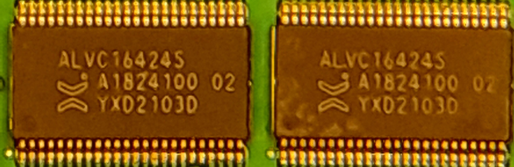
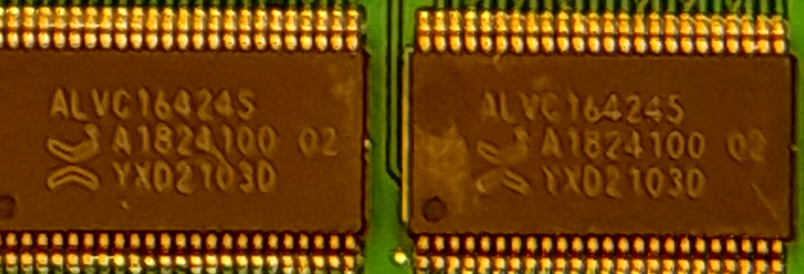
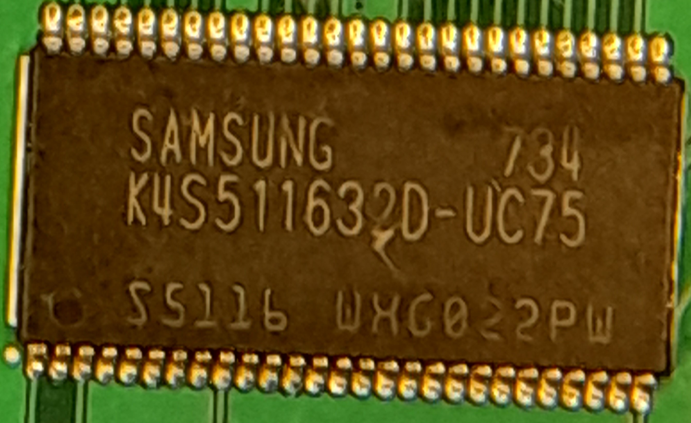

**English** | [Português](pt-br.md)

# SAROO - Cartridge Model

### General Info

- <b>Vendor/Store:</b> [Retro Game Paradise Store](https://s.click.aliexpress.com/e/_Dl2XgzD)
- <b>Version:</b> V1.32F
- <b>Model:</b> Green Card

#### Purchase Links (AliExpress)

- https://s.click.aliexpress.com/e/_DBkI7hz
- https://s.click.aliexpress.com/e/_Dmz9Rmn
- https://s.click.aliexpress.com/e/_Dm27GUX
- https://s.click.aliexpress.com/e/_DFGd6bz

#### Some Chips

- ALVC16424S / A1824100 02 / YXD2103D (4 chips)
- ALTERA Cyclone IV / EPACE6F17CON / G BCAAA12135 / MALAYSIA / VCAAA482 / 3N3G1 4100 (1 chip)
- SAMSUNG 734 / K4S5116320-UC75 / S5116 WHG022PW (1 chip)
- STM324750 / VBT6 V / 7824V VQ / PHL 78 322 / ST ARM (1 chip)

#### Images

Shell Outside:

Shell Inside:

PCB Front:

PCB Back:

- ALVC16424S / A1824100 02 / YXD2103D (4 chips)

- ALTERA Cyclone IV / EPACE6F17CON / G BCAAA12135 / MALAYSIA / VCAAA482 / 3N3G1 4100 (1 chip)

- SAMSUNG 734 / K4S5116320-UC75 / S5116 WHG022PW (1 chip)

- STM324750 / VBT6 V / 7824V VQ / PHL 78 322 / ST ARM (1 chip)

Lights:

