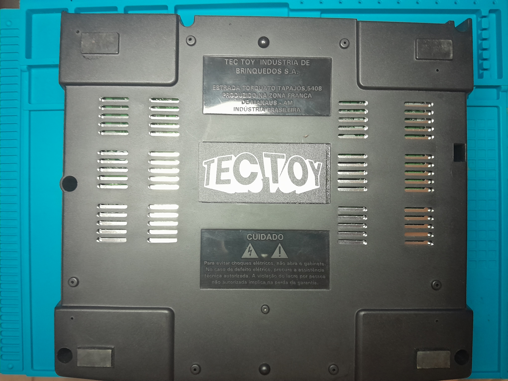
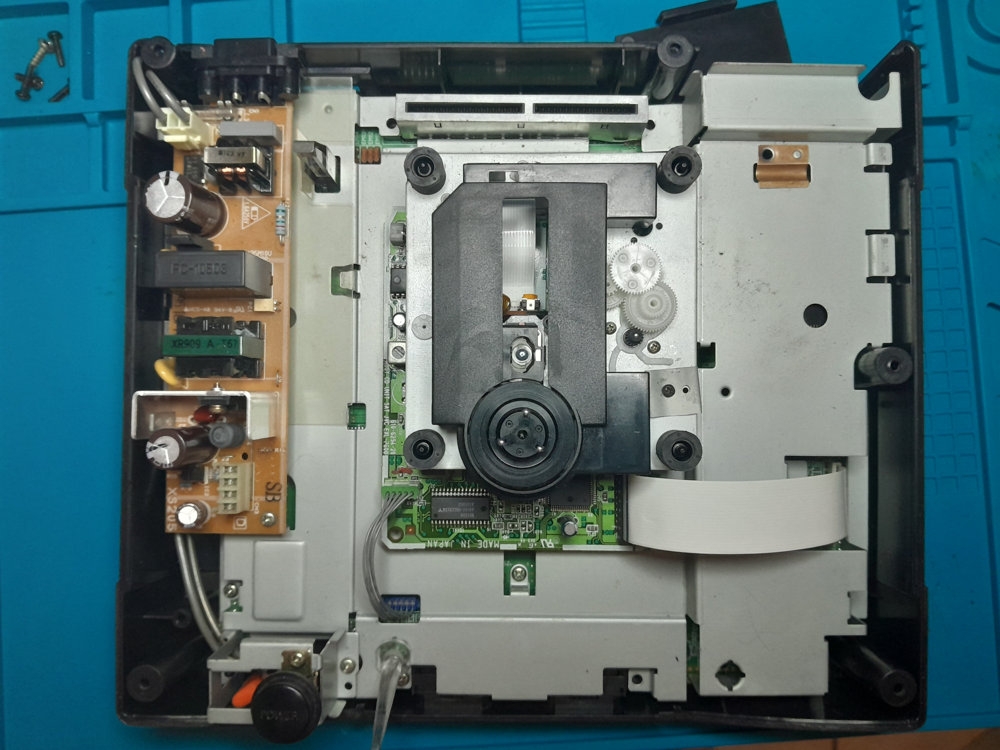
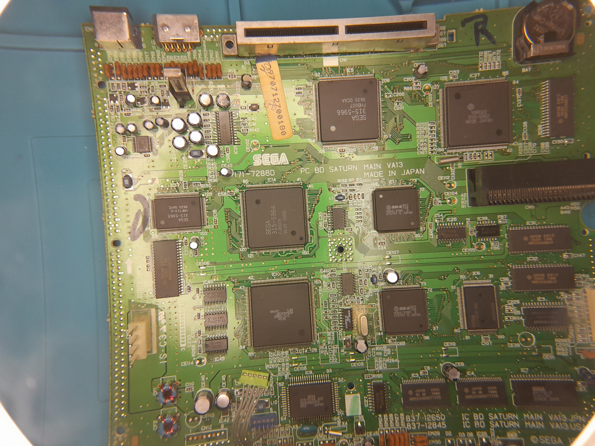
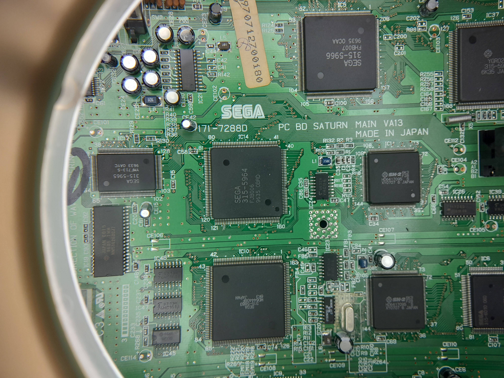
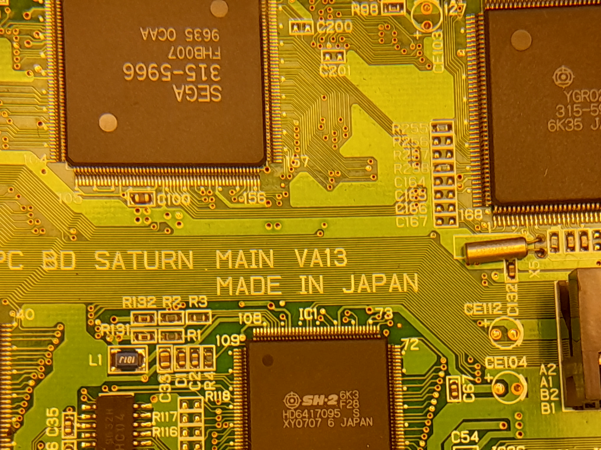
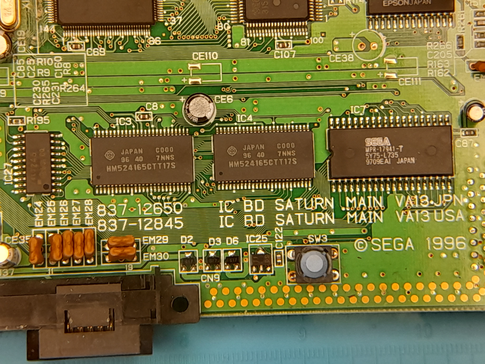

[English](README.md) | **Português**

# Modelo do Sega Saturn

### Informações Gerais

- <b>Versão da BIOS:</b> V1.00a (1995)
- <b>Região:</b> US - NTSC ou FREE - PAL-M ?
- <b>Modelo:</b> HST-3220 (Preto - Tectoy)
- <b>País:</b> Brasil
- <b>Revisão:</b> VA13 / 171-7288D PC BD SATURN MAIN VA13 / 837-12650 IC BD SATURN MAIN VA13 JPN

#### Imagens

